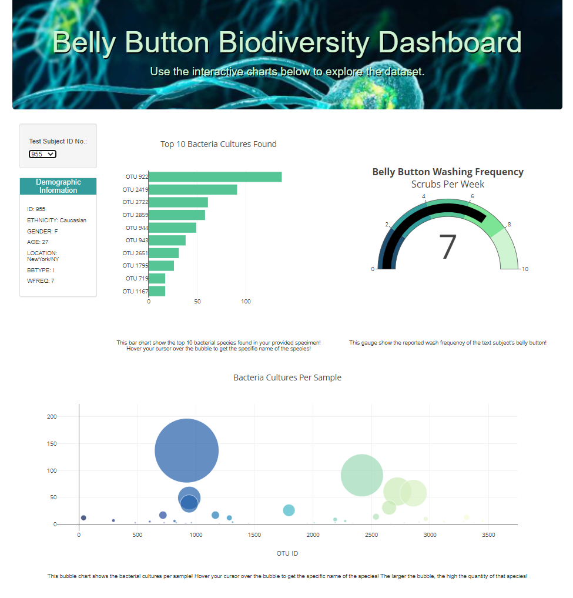
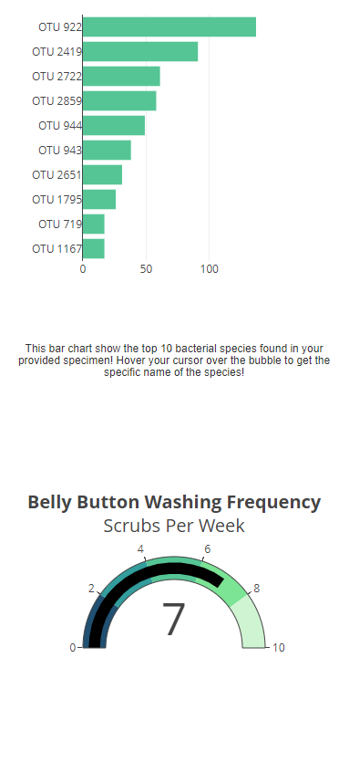

# Belly_Button_Biodiversity

## Link to Webpage
Please [click this link here](https://kevindbrian.github.io/Belly_Button_Biodiversity/) to visit the webpage!

## Resources
*   Data Source
    *   [samples.json](samples.json)
*   Software
    *   Visual Studio Code 1.63.2
    *   Plotly 2.11.1
    *   Google Chrome 99.0.4844.51 (Official Build) (32-bit)

## Overview

The purpose of this project was to generate a webpage for test subjects in a biodiversity study to see their results. The page allows users to find their unique ID from a dropdown menu and the page automatically updates to display their results via bar, bubble and gauge charts.

## Results

The page itself properly displays all three charts with short descriptions below them. Some customization was also added like the header image and color palette. Shadows needed to be added to the text within the header image to make it easier to read also (see the [style.css](static/css/style.css) file). The page and charts themselves are also responsive and auto adjust to the users screen size, making the webpage mobile friendly.

### Image of the Webpage

### Image of the Page on a iPhone 12 Pro

